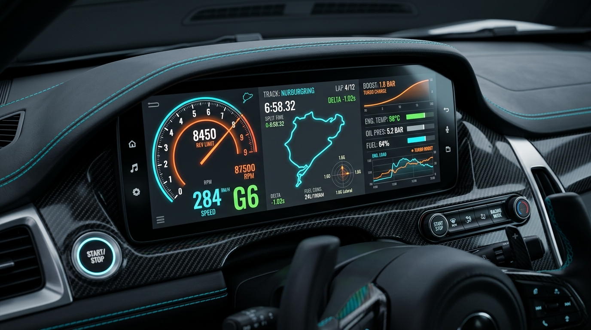
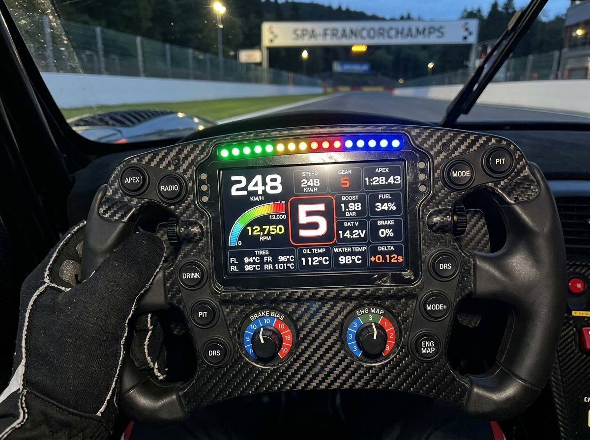

# OBDash 🏎️💨
### *Premium High-Fidelity Custom Digital Gauge Cluster & OBDII Telemetry System*

<p align="center">
  
</p>

<p align="center">
  
  
  
  
  
</p>

---

## 📖 Overview

**OBDash** is a state-of-the-art, high-fidelity interactive digital gauge dashboard designed for premium supercars, track enthusiasts, and advanced telemetry visualizers. Written from the ground up in **React 18 + TypeScript**, styled with **Tailwind CSS**, and optimized with smooth **Framer Motion** state transitions, OBDash mimics ultra-wide 12.3-inch (1920x720) panoramic virtual cockpits.

It accepts high-frequency live real-time variables corresponding to OBD-II outputs (like Boost PSI, RPM, Coolant and Oil Temperatures, Battery Volts, Engine Load, and Throttle Position) and drives ultra-precise, design-crafted physical renderings.

---

## 🎨 Featured Skins Gallery

OBDash is fully skin-customizable. Drivers can switch between unique themes at the press of a button.

### 1. F1 LCD Precision Dashboard
Inspired by modern Formula 1 and GT3 steering wheel displays, this design brings high-density motorsport telemetry into sharp focus.
<p align="center">
  
</p>

*   **Sequential Shift LED Beam**: Dynamic green-yellow-red-blue indicator row prompting ideal shifting frames.
*   **Massive Center Gear Registry**: Oversized hyper-legible gear display.
*   **Motorsport Matrix Telemetry**: Embedded telemetry modules displaying real-time Boost, Engine Load, Throttle %, and crucial battery and oil metrics.

### 2. Fighter Jet HUD (Heads-Up Display)
Inspired by military-grade aviation, the Tactical HUD uses bright neon vector ribbons and target reticles for high-speed tracking.
<p align="center">
  
</p>

*   **Aviation Ribbons**: Interactive scrolling speed and altitude ribbons matching current drive states.
*   **Concentric Radar Scope**: Simulates localized sweeping coordinates linked to active lateral forces.
*   **Aero-Fluorescent Dial Geometry**: Tactical data grids for temperature and pressure levels.

### 3. Other Immersive Theme Schemes
*   **Carbon Sweep**: Smooth sweeping LEDs set against a high-contrast real-woven carbon fabric pattern.
*   **Retro Digital Arcade**: Interactive, neon synthwave pink-to-cyan theme with scanning grid lines and glowing pixel art displays.
*   **Modern EV Range**: Elegant design clean-spaces focused on current charge, efficiency metrics (`mi/kWh`), and quiet minimalist layouts.
*   **Perspective Cluster**: Multi-layered 2.5D visual depth using subtle spatial isometric scaling that shifts gracefully with speed.
*   **Quasar Cosmic Loop**: Celestial orb structure with deep space gravity loops tracking energy consumption and current momentum.

---

## ⚙️ Technical Highlights

### ⚡ State Damping & Telemetry Feeds
The virtual dials implement customized React interpolation models simulating gauge weight and physical momentum:
- Snapping needles are smoothed using spring physics configs (`tension: 300, friction: 20`).
- Shift shocks shake needle root bones for `0.15s` on gear transitions to mimic mechanical feel.

### 🛡️ Live Safety Warning System
An intelligent active control panel hooks into engine telemetry, driving safety lighting warnings and visual alerts on critical parameters:
- **Engine Temp Overheat**: Warns when Coolant Temperature exceeds customizable thresholds (>230°F).
- **TPMS & ABS Alerts**: Active tracking for safety assist networks.
- **Dynamic Turn Indicators**: Dynamic left-and-right pulsing chevron vector lights.
- **Low Fuel & Low Voltage**: Alerts trigger on sub-11.5V values or critical reserves.

### 🎛️ Unified Customization engine
Adjust critical car boundaries inside the customizer:
- Custom max RPM redlines (e.g. `8,000` RPM for luxury sedans vs `10,000` RPM for track limits).
- Seamless switches between standard Imperial metrics Display (`°F`, `PSI`, `mph`) and Metric (`°C`, `BAR`, `km/h`).

---

## 📁 Directory & File Architecture

```bash
├── components/
│   ├── F1LCDGauge.tsx               # Formula 1 motorsport grid layout
│   ├── FighterJetHUDGauge.tsx       # Aviation design vector HUD
│   ├── DigitalDashRetro.tsx         # Retro arcade synthwave cluster
│   ├── CarbonSweepGauge.tsx         # Premium carbon-fiber radial needle layout
│   ├── ModernEVGauge.tsx            # Clean-space EV range UI
│   ├── PerspectiveClusterGauge.tsx  # Dynamic 2.5D visual isometric layout
│   ├── QuasarGauge.tsx              # Deep space cosmic gravity dials
│   ├── AggressiveRaceGauge.tsx      # High-contrast track performance cluster
│   ├── Gauge.tsx                    # Shared tactical modules, PidBoxes, & dispatchers
│   └── Navigation.tsx               # Built-in live map & route navigation
├── services/
│   └── obdService.ts                # Real OBDII telemetry stream generator
├── App.tsx                          # Primary layout host and view controller
├── types.ts                         # Strongly-typed VehicleData structures
└── TDD_Gauge_Cluster_Android.md     # Jetpack Compose native blueprint design doc
```

---

## 🚀 Getting Started

### 📦 Prerequisites
- **Node.js** (v18 or higher recommended)
- **npm** or any modern package builder

### 🛠️ Local Installation
Clone and jump into the repository path:
```bash
git clone https://github.com/Freshman0000/OBDash.git
cd OBDash
```

Install all dependencies listed in the manifest package tree:
```bash
npm install
```

### 🏃 Running Dev Server
Boot up the instantaneous dev server compiling with Vite:
```bash
npm run dev
```
Open [http://localhost:3000](http://localhost:3000) on your local browser to interact with the responsive dashboard preview!

### 🏗️ Compiling for Production Build
Bundle optimized lightweight production static folders inside `/dist/`:
```bash
npm run build
```

---

## 📱 Mobile Adaptation (Capacitor/Android Integration)
OBDash includes native configuration hooks for Android, targeting immersive landscape panoramic mount setups:
- Configured via `capacitor.config.ts`.
- Manifest structure aligned to full-screen display modes (immersed status rows, landscape lock bounds).
- Comprehensive Jetpack Compose pseudo-code layouts available in `TDD_Gauge_Cluster_Android.md` for developers interested in native Android re-implementations!

---

<p align="center">
  *Designed with passion for the track. Drive safe.* 🏁
</p>
